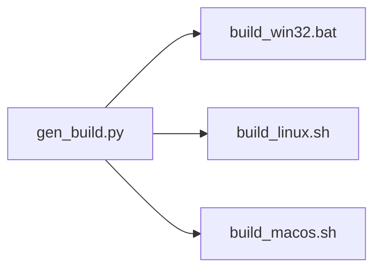

<h1 align="center">
  Pilot Light Build
</h1>

The **pl-build** tool is a lightweight utility used to generate batch/bash build scripts.

### Background
The **pl-build** tool is a part of the larger [Pilot Light](https://github.com/PilotLightTech/pilotlight) project. In this larger project, we do not have a "build system" per se. Instead we prefer to write batch/bash scripts that directly call the compiler (in a manner similar to Casey Muratori's [Handmade Hero](https://handmadehero.org/)). If this project was an end user product, this would be the end of it. However, this is not the case. It is meant to be easily extended through adding additional extensions and being used as a "pilot light" to start new projects. With this comes a couple issues. Extensions are meant to be cross platform so users need the ability to easily add new binaries for all target platforms with minimal duplication. Users shouldn't need to be bash or batch scripting experts to build new targets for all platforms and shouldn't need to test the build scripts continuously on each platform. 

Another way of putting it, is we want to focus on what matters to build binaries. Ultimately this is just compiler & linker settings. We don't want to think about the differences in bash/batch syntax.

The idea is simple:



### Features

* entire system can be understood in an hour
* minimizes duplicated information
* generates standalone simple build scripts
* fine-grained control over compilation & linker settings
* supports hot reloading
* easily extended to add new platforms & compilers
* extremely light weight
* no preference on editor/IDE
* doesn't pretend different platforms don't exist

## Documentation
Documentation can be found [here](https://github.com/PilotLightTech/pilotlight/wiki/Build-System).

## Examples

### Real World
Complete & more advanced examples can be found here:
* [gen_dev.py](https://github.com/PilotLightTech/pilotlight/blob/master/scripts/gen_dev.py)
* [gen_examples.py](https://github.com/PilotLightTech/pilotlight/blob/master/scripts/gen_examples.py)
* [gen_tests.py](https://github.com/PilotLightTech/pilotlight/blob/master/scripts/gen_tests.py)
* [gen_distribute.py](https://github.com/PilotLightTech/pilotlight/blob/master/scripts/gen_distribute.py)

### Basic Example

This is just an example of the what an input and output scripts look like (this will not actually run).

#### input - gen_build.py
```python
import pl_build.core as pl
import pl_build.backend_win32 as win32
import pl_build.backend_linux as linux
import pl_build.backend_macos as macos

with pl.project("tutorial"):

    pl.set_hot_reload_target("../out/pilot_light")

    with pl.target("example", pl.TargetType.EXECUTABLE):

        # shared across configs
        pl.set_output_directory("out")
        pl.set_output_binary("example")
        pl.add_source_files("main.c")

        with pl.configuration("debug"):

            with pl.platform("Windows"):
                with pl.compiler("msvc"):
                    pl.add_compiler_flags("-Od")

            with pl.platform("Linux"):
                with pl.compiler("gcc"):
                    pl.add_compiler_flags("-g")
                    pl.add_linker_flags("-ldl")

            with pl.platform("Darwin"):
                with pl.compiler("clang"):
                    pl.add_compiler_flags("-g", "--debug")
                    pl.add_link_directories("/usr/local/lib")
                    
win32.generate_build("build_win32.bat")
linux.generate_build("build_linux.sh")
macos.generate_build("build_macos.sh")
```