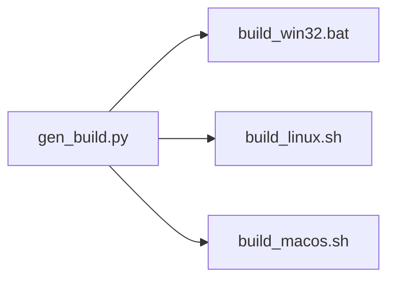

<h1 align="center">
  Pilot Light Build
</h1>

The **pl-build** tool is a lightweight utility used to generate batch/bash build scripts.

### Background
The **pl-build** tool is a part of the larger [Pilot Light](https://github.com/PilotLightTech/pilotlight) project. In this larger project, we do not have a "build system" per se. Instead we prefer to write batch/bash scripts that directly call the compiler (in a manner similar to Casey Muratori's [Handmade Hero](https://handmadehero.org/)). If this project was an end user product, this would be the end of it. However, this is not the case. It is meant to be easily extended through adding additional extensions and being used as a "pilot light" to start new projects. With this comes a couple issues. Extensions are meant to be cross platform so users need the ability to easily add new binaries for all target platforms with minimal duplication. Users shouldn't need to be bash or batch scripting experts to build new targets for all platforms and shouldn't need to test the build scripts continuously on each platform. 

Another way of putting it, is we want to focus on what matters to build binaries. Ultimately this is just compiler & linker settings. We don't want to think about the differences in bash/batch syntax.

The idea is simple:



### Features

* entire system can be understood in an hour
* minimizes duplicated information
* generates standalone simple build scripts
* fine-grained control over compilation & linker settings
* supports hot reloading
* easily extended to add new platforms & compilers
* extremely light weight
* no preference on editor/IDE
* doesn't pretend different platforms don't exist

## Documentation
Documentation can be found [here](https://github.com/PilotLightTech/pilotlight/wiki/Build-System).

## Examples

### Real World
Complete & more advanced examples can be found here:
* [gen_core.py](https://github.com/PilotLightTech/pilotlight/blob/master/scripts/gen_core.py)
* [gen_examples.py](https://github.com/PilotLightTech/pilotlight/blob/master/scripts/gen_examples.py)
* [gen_tests.py](https://github.com/PilotLightTech/pilotlight/blob/master/scripts/gen_tests.py)

### Basic Example

This is just an example of the what an input and output scripts look like (this will not actually run).

#### input - gen_build.py
```python
import pl_build.core as pl
import pl_build.backend_win32 as win32
import pl_build.backend_linux as linux
import pl_build.backend_macos as macos

with pl.project("tutorial"):

    pl.set_hot_reload_target("../out/pilot_light")

    with pl.target("example", pl.TargetType.EXECUTABLE):

        # shared across configs
        pl.set_output_directory("out")
        pl.set_output_binary("example")
        pl.add_source_files("main.c")

        with pl.configuration("debug"):

            with pl.platform("Windows"):
                with pl.compiler("msvc"):
                    pl.add_compiler_flags("-Od")

            with pl.platform("Linux"):
                with pl.compiler("gcc"):
                    pl.add_compiler_flags("-g")
                    pl.add_linker_flags("-ldl")

            with pl.platform("Darwin"):
                with pl.compiler("clang"):
                    pl.add_compiler_flags("-g", "--debug")
                    pl.add_linker_flags("-Wl,-rpath,/usr/local/lib")
                    
win32.generate_build("build_win32.bat")
linux.generate_build("build_linux.sh")
macos.generate_build("build_macos.sh")
```

#### output - build_win32.bat
```batch

:: Project: tutorial
:: Auto Generated by:
:: "pl_build.py" version: 1.0.5

:: Project: tutorial

:: ################################################################################
:: #                              Development Setup                               #
:: ################################################################################

:: keep environment variables modifications local
@setlocal

:: make script directory CWD
@pushd %~dp0
@set dir=%~dp0

:: default compilation result
@set PL_RESULT=Successful.

:: default configuration
@set PL_CONFIG=debug

:: check command line args for configuration
:CheckConfiguration
@if "%~1"=="-c" (@set PL_CONFIG=%2) & @shift & @shift & @goto CheckConfiguration
@if "%PL_CONFIG%" equ "debug" ( goto debug )

:: ################################################################################
:: #                            configuration | debug                             #
:: ################################################################################

:debug

:: create output directories
@if not exist "out" @mkdir "out"

:: create lock file(s)
@echo LOCKING > "out/lock.tmp"

@if exist "out/tutorial.exe" del "out\tutorial.exe"
@if exist "out/tutorial_*.pdb" del "out\tutorial_*.pdb"

::~~~~~~~~~~~~~~~~~~~~~~~~~~~~~~~ tutorial | debug ~~~~~~~~~~~~~~~~~~~~~~~~~~~~~~~

@set PL_LINKER_FLAGS=-incremental:no 
@set PL_SOURCES="main.c" 

:: run compiler (and linker)
@echo.
@echo Step: tutorial
@echo ~~~~~~~~~~~~~~~~~~~~~~
@echo Compiling and Linking...

:: call compiler
cl %PL_SOURCES% -Fe"out/tutorial.exe" -Fo"out/" -link %PL_LINKER_FLAGS% -PDB:"out/tutorial_%random%.pdb"

:: check build status
@set PL_BUILD_STATUS=%ERRORLEVEL%

:: failed
@if %PL_BUILD_STATUS% NEQ 0 (
    @echo Compilation Failed with error code: %PL_BUILD_STATUS%
    @set PL_RESULT=Failed.
    goto Cleanupdebug
)

:: print results
@echo Result:  %PL_RESULT%
@echo ~~~~~~~~~~~~~~~~~~~~~~

:Exit_tutorial

:Cleanupdebug

@echo Cleaning...

:: delete obj files(s)
@del "out\*.obj"  > nul 2> nul

:: delete lock file(s)
@if exist "out/lock.tmp" del "out\lock.tmp"

:: ~~~~~~~~~~~~~~~~~~~~~~~~~~~~~~~~~~~~~~~~
:: end of debug configuration
goto ExitLabel

:ExitLabel

:: return CWD to previous CWD
@popd

```

#### output - build_macos.sh

```bash

# Auto Generated by:
# "pl_build.py" version: 1.0.5

# Project: tutorial

# ################################################################################
# #                              Development Setup                               #
# ################################################################################

# colors
BOLD=$'\e[0;1m'
RED=$'\e[0;31m'
RED_BG=$'\e[0;41m'
GREEN=$'\e[0;32m'
GREEN_BG=$'\e[0;42m'
CYAN=$'\e[0;36m'
MAGENTA=$'\e[0;35m'
YELLOW=$'\e[0;33m'
WHITE=$'\e[0;97m'
NC=$'\e[0m'

# find directory of this script
SOURCE=${BASH_SOURCE[0]}
while [ -h "$SOURCE" ]; do # resolve $SOURCE until the file is no longer a symlink
  DIR=$( cd -P "$( dirname "$SOURCE" )" >/dev/null 2>&1 && pwd )
  SOURCE=$(readlink "$SOURCE")
  [[ $SOURCE != /* ]] && SOURCE=$DIR/$SOURCE # if $SOURCE was a relative symlink, we need to resolve it relative to the path where the symlink file was located
done
DIR=$( cd -P "$( dirname "$SOURCE" )" >/dev/null 2>&1 && pwd )

# get architecture (intel or apple silicon)
ARCH="$(uname -m)"

# make script directory CWD
pushd $DIR >/dev/null

# default configuration
PL_CONFIG=debug

# check command line args for configuration
while getopts ":c:" option; do
   case $option in
   c) # set conf
         PL_CONFIG=$OPTARG;;
     \?) # Invalid option
         echo "Error: Invalid option"
         exit;;
   esac
done

# ################################################################################
# #                            configuration | debug                             #
# ################################################################################

if [[ "$PL_CONFIG" == "debug" ]]; then

# create output directory(s)
mkdir -p "out"

# create lock file(s)
echo LOCKING > "out/lock.tmp"

# check if this is a reload
PL_HOT_RELOAD_STATUS=0

# # let user know if hot reloading
running_count=$(ps aux | grep -v grep | grep -ci "pilot_light")
if [ $running_count -gt 0 ]
then
    PL_HOT_RELOAD_STATUS=1
    echo
    echo echo ${BOLD}${WHITE}${RED_BG}--------${GREEN_BG} HOT RELOADING ${RED_BG}--------${NC}
    echo echo
else
    # cleanup binaries if not hot reloading
    echo PL_HOT_RELOAD_STATUS=0
    rm -f "out/tutorial"

fi
#~~~~~~~~~~~~~~~~~~~~~~~~~~~~~~~ tutorial | debug ~~~~~~~~~~~~~~~~~~~~~~~~~~~~~~~

# skip during hot reload
if [ $PL_HOT_RELOAD_STATUS -ne 1 ]; then

PL_RESULT=${BOLD}${GREEN}Successful.${NC}
PL_DEFINES=""
PL_INCLUDE_DIRECTORIES=""
PL_LINK_DIRECTORIES=""
PL_COMPILER_FLAGS="-g --debug "
PL_LINKER_FLAGS="-Wl,-rpath,/usr/local/lib "
PL_STATIC_LINK_LIBRARIES=""
PL_DYNAMIC_LINK_LIBRARIES=""
PL_SOURCES="main.c "
PL_LINK_FRAMEWORKS=""

# add flags for specific hardware
if [[ "$ARCH" == "arm64" ]]; then
    PL_COMPILER_FLAGS+="-arch arm64 "
else
    PL_COMPILER_FLAGS+="-arch x86_64 "
fi

# run compiler (and linker)
echo
echo ${YELLOW}Step: tutorial${NC}
echo ${YELLOW}~~~~~~~~~~~~~~~~~~~${NC}
echo ${CYAN}Compiling and Linking...${NC}
clang $PL_SOURCES $PL_INCLUDE_DIRECTORIES $PL_DEFINES $PL_COMPILER_FLAGS $PL_INCLUDE_DIRECTORIES $PL_LINK_DIRECTORIES $PL_LINKER_FLAGS $PL_STATIC_LINK_LIBRARIES $PL_DYNAMIC_LINK_LIBRARIES -o "./out/tutorial"

# check build status
if [ $? -ne 0 ]
then
    PL_RESULT=${BOLD}${RED}Failed.${NC}
fi

# print results
echo ${CYAN}Results: ${NC} ${PL_RESULT}
echo ${CYAN}~~~~~~~~~~~~~~~~~~~~~~${NC}

# hot reload skip
fi

# delete lock file(s)
rm -f "out/lock.tmp"

# ~~~~~~~~~~~~~~~~~~~~~~~~~~~~~~~~~~~~~~~~
# end of debug
fi


# return CWD to previous CWD
popd >/dev/null

```

#### output - build_linux.sh

```bash
#!/bin/bash

# Auto Generated by:
# "pl_build.py" version: 1.0.5

# Project: tutorial

# ################################################################################
# #                              Development Setup                               #
# ################################################################################

# colors
BOLD=$'\e[0;1m'
RED=$'\e[0;31m'
RED_BG=$'\e[0;41m'
GREEN=$'\e[0;32m'
GREEN_BG=$'\e[0;42m'
CYAN=$'\e[0;36m'
MAGENTA=$'\e[0;35m'
YELLOW=$'\e[0;33m'
WHITE=$'\e[0;97m'
NC=$'\e[0m'

# find directory of this script
SOURCE=${BASH_SOURCE[0]}
while [ -h "$SOURCE" ]; do # resolve $SOURCE until the file is no longer a symlink
  DIR=$( cd -P "$( dirname "$SOURCE" )" >/dev/null 2>&1 && pwd )
  SOURCE=$(readlink "$SOURCE")
  [[ $SOURCE != /* ]] && SOURCE=$DIR/$SOURCE # if $SOURCE was a relative symlink, we need to resolve it relative to the path where the symlink file was located
done
DIR=$( cd -P "$( dirname "$SOURCE" )" >/dev/null 2>&1 && pwd )

# make script directory CWD
pushd $DIR >/dev/null

# default configuration
PL_CONFIG=debug

# check command line args for configuration
while getopts ":c:" option; do
   case $option in
   c) # set conf
         PL_CONFIG=$OPTARG;;
     \?) # Invalid option
         echo "Error: Invalid option"
         exit;;
   esac
done

# ################################################################################
# #                            configuration | debug                             #
# ################################################################################

if [[ "$PL_CONFIG" == "debug" ]]; then

# create output directory(s)
mkdir -p "out"

# create lock file(s)
echo LOCKING > "out/lock.tmp"

# check if this is a reload
PL_HOT_RELOAD_STATUS=0

# # let user know if hot reloading
if pidof -x "pilot_light" -o $$ >/dev/null;then
    PL_HOT_RELOAD_STATUS=1
    echo
    echo echo ${BOLD}${WHITE}${RED_BG}--------${GREEN_BG} HOT RELOADING ${RED_BG}--------${NC}
    echo echo
else
    # cleanup binaries if not hot reloading
    echo PL_HOT_RELOAD_STATUS=0
    rm -f "out/tutorial"


fi
#~~~~~~~~~~~~~~~~~~~~~~~~~~~~~~~ tutorial | debug ~~~~~~~~~~~~~~~~~~~~~~~~~~~~~~~

# skip during hot reload
if [ $PL_HOT_RELOAD_STATUS -ne 1 ]; then

PL_RESULT=${BOLD}${GREEN}Successful.${NC}
PL_DEFINES=""
PL_INCLUDE_DIRECTORIES=""
PL_LINK_DIRECTORIES=""
PL_COMPILER_FLAGS="-g "
PL_LINKER_FLAGS="-ldl "
PL_STATIC_LINK_LIBRARIES=""
PL_DYNAMIC_LINK_LIBRARIES=""
PL_SOURCES="main.c "

# run compiler (and linker)
echo
echo ${YELLOW}Step: tutorial${NC}
echo ${YELLOW}~~~~~~~~~~~~~~~~~~~${NC}
echo ${CYAN}Compiling and Linking...${NC}
gcc $PL_SOURCES $PL_INCLUDE_DIRECTORIES $PL_DEFINES $PL_COMPILER_FLAGS $PL_INCLUDE_DIRECTORIES $PL_LINK_DIRECTORIES $PL_LINKER_FLAGS $PL_STATIC_LINK_LIBRARIES $PL_DYNAMIC_LINK_LIBRARIES -o "./out/tutorial"

# check build status
if [ $? -ne 0 ]
then
    PL_RESULT=${BOLD}${RED}Failed.${NC}
fi

# print results
echo ${CYAN}Results: ${NC} ${PL_RESULT}
echo ${CYAN}~~~~~~~~~~~~~~~~~~~~~~${NC}

# hot reload skip
fi

# delete lock file(s)
rm -f "out/lock.tmp"

# ~~~~~~~~~~~~~~~~~~~~~~~~~~~~~~~~~~~~~~~~
# end of debug
fi


# return CWD to previous CWD
popd >/dev/null


```